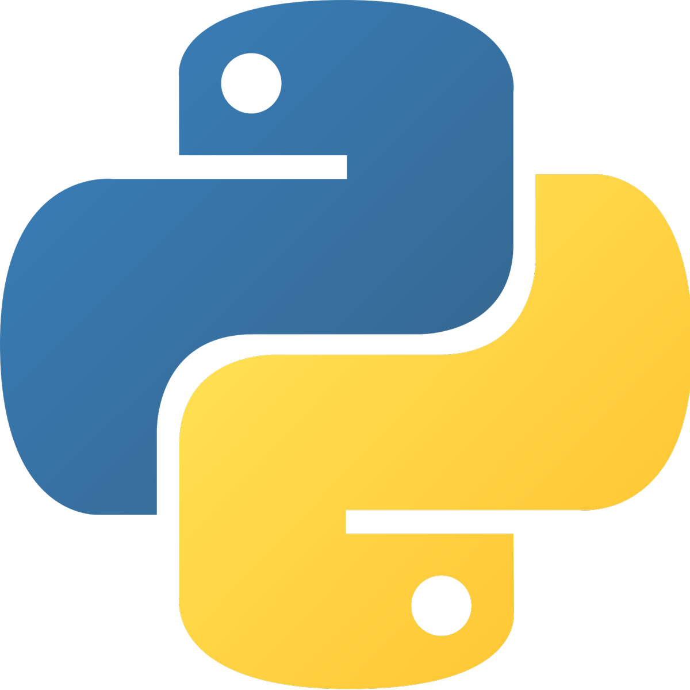

# Python 

## 1: Python Foundations

### [1.1 Python Setup & Development Environment](./01_Python_Foundations/1.1_Python_Setup_and_Development_Environment.md)

- Python installation (pyenv, system Python)
- Virtual environments: venv, pipenv, poetry

### [1.2 Python Syntax and Core Constructs](./01_Python_Foundations/1.2_Python_Syntax_and_Core_Constructs.md)

- Variables, expressions, statements
- Input/output, string formatting
- Data types: int, float, bool, str
- Conditionals: if, elif, else
- Loops: for, while, range, break, continue
- Functions: def, return, parameters
- Basic recursion

### [1.3 Data Structures in Depth](./01_Python_Foundations/1.3_Data_Structures_in_Depth.md)

- Strings (slicing, immutability)
- Lists (methods, nested lists)
- Tuples (immutability, unpacking)
- Sets (operations, uniqueness)
- Dictionaries (key-value storage, iteration)
- List/dict/set comprehensions (complex nesting)

### [1.4 Error Handling & Debugging](./01_Python_Foundations/1.4_Error_Handling_and_Debugging.md)

- Built-in exceptions
- try/except/else/finally
- Raising custom exceptions
- Using pdb, breakpoints in IDEs
- Logging basics

### [1.5 Modules & Standard Library](./01_Python_Foundations/1.5_Modules_and_Standard_Library.md)

- Writing custom modules
- Import styles
- Key modules: math, random, datetime, collections, itertools

### [1.6 File I/O](./01_Python_Foundations/1.6_File_IO.md)

- Reading and writing text/binary files
- Working with CSV, JSON
- os, pathlib, shutil, glob

## 2: Intermediate Python

### [2.1 Functions & Advanced Functional Programming](./02_Intermediate_Python/2.1_Functions_and_Advanced_Functional_Programming.md)

- `**args` and `**kwargs`
- Closures, lexical scoping
- Decorators (with parameters)
- Lambdas, map, filter, reduce
- functools.partial, operator module

### 2.2 Object-Oriented Programming

- Classes, instances, and attributes
- Instance vs class methods vs static methods
- Encapsulation and private variables
- Inheritance and method overriding
- Dunder methods: **str**, **repr**, **eq**, etc.
- Composition over inheritance

### 2.3 Iterators, Generators, and Context Managers

- Custom iterators (**iter**, **next**)
- Generator functions and expressions
- Context managers: with, **enter**, **exit**
- contextlib utilities (suppress, contextmanager)

### 2.4 Type Hinting & Static Typing

- typing module (List, Dict, Tuple, Union, Optional, Callable)
- Type aliases and custom types
- Using mypy, pyright

### 2.5 Testing

- unittest vs pytest
- Fixtures and parametrize
- Mocking and patching
- Coverage reports

### 2.6 Packaging & Versioning

- setuptools, wheel, twine
- pyproject.toml
- Semantic versioning
- Dependency management with requirements.txt vs poetry

## 3: Advanced Python Concepts

### 3.1 Advanced Language Features

- Introspection: dir(), hasattr(), getattr()
- eval(), exec(), compile()
- Decorator chaining, class decorators
- Metaclasses and dynamic class creation

### 3.2 Performance & Memory

- Time profiling: timeit, cProfile, line_profiler
- Memory profiling: memory_profiler, tracemalloc
- Performance optimization: caching, batching
- Use of generators and **slots**

### 3.3 Concurrency and Parallelism

- Threading: threading, queue
- Multiprocessing: Process, Pool, Manager
- Asyncio: async, await, event loop, coroutines
- concurrent.futures, ThreadPoolExecutor
- Comparing performance and use-cases

## 4: Backend Web Development

### 4.1 Web Basics

- Client-server model
- HTTP protocol and status codes
- RESTful API design principles
- CORS, rate-limiting, API versioning

### 4.2 FastAPI (Primary Framework)

- Request/response lifecycle
- Path, query, body, form parameters
- Pydantic models for validation
- Dependency injection
- Middleware, hooks
- Background tasks
- Auto-generated docs with Swagger/ReDoc

### 4.3 Flask (Alternative Option)

- Routing, templating
- Blueprints, Jinja2
- RESTful extension libraries

### 4.4 Authentication & Security

- OAuth2, JWT, token-based auth
- Login/signup systems
- Password hashing (bcrypt, passlib)
- Rate limiting, brute-force prevention
- Role-based access control (RBAC)

### 4.5 Database Integration

- Relational DBs: PostgreSQL, MySQL
- SQLAlchemy (Core + ORM)
- Alembic migrations
- Async drivers (Databases, Tortoise ORM)
- Query optimization and indexing

### 4.6 File & Media Handling

- File upload/download endpoints
- Serving static/media files
- Integrating with Amazon S3 or MinIO

### 4.7 Background Jobs

- Celery with Redis/RabbitMQ
- Chaining, retry policies, result backend
- Periodic tasks (cron-style)

### 4.8 WebSockets

- WebSocket endpoints with FastAPI
- Real-time notifications/chat
- Authentication with WebSockets

### 4.9 Sending Emails

- SMTP integration
- HTML email templates
- Async email sending via Celery

## 5: DevOps & Deployment for Python Backends

### 5.1 Docker & Containerization

- Writing Dockerfiles for Python APIs
- Using .dockerignore and multistage builds
- Docker Compose for local development

### 5.2 Environment & Configuration Management

- .env files and python-dotenv
- Pydantic Settings management
- Secrets and config separation per environment

### 5.3 CI/CD

- GitHub Actions, GitLab CI, Jenkins pipelines
- Running tests, linters, formatters
- Automatic Docker image builds

### 5.4 Production Deployment

- Uvicorn + Gunicorn setup
- Reverse proxy with NGINX
- HTTPS with Let's Encrypt / Traefik
- Hosting on EC2, Render, Fly.io, Railway

### 5.5 Observability

- Logging: logging, JSON logs
- Tracing: OpenTelemetry
- Monitoring: Prometheus + Grafana
- Error tracking: Sentry

## 6: Project Portfolio

### Must-Build Projects

- Blog API (CRUD + Auth)
- E-Commerce API (multi-role, payments, cart)
- Task Scheduler API (Celery + REST)
- Real-time Chat backend (WebSockets)
- File Upload API (local + cloud storage)
- SaaS API with billing & multitenancy

### Architecture & Best Practices

- Domain-driven structure
- Service/repository patterns
- Layered design (models, services, routers)
- Pagination, filtering, searching APIs
- OpenAPI, Postman collections

## 7: Specialization Tracks

- GraphQL: Ariadne or Strawberry
- gRPC: Protocol Buffers + grpcio
- Kafka: Event streaming for services
- Microservices: Message queues, circuit breakers
- CLI Apps: click, argparse
- Web Scraping: httpx, selectolax, beautifulsoup4
- NLP & ML: Serving models as APIs
- Async First Stack: FastAPI + asyncpg + Redis + Celery
